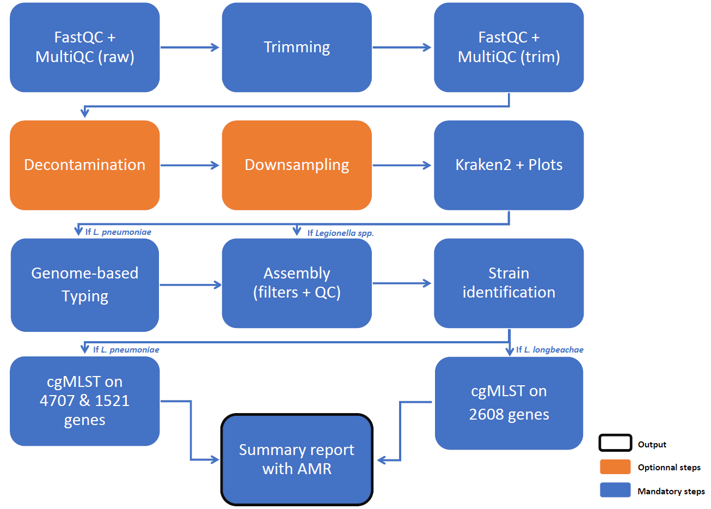

# Assembly + MLST Pipeline (Nextflow)

This pipeline assembles Illumina data and then searches for mutations in a set of genes to characterise the strain under study (Multilocus Sequence Typing approach = MLST).
It supports paired-end data and optional adapter trimming. Different treatment approaches are also supported depending on the strain of Legionella identified. 

```
Pipeline_*/
├── assets/             static data (data/db/etc.) for Nextflow pipelines
├── bin/                scripts for modules files
├── config/             config files for Nextflow pipelines
├── modules/            modules files for Nextflow pipelines
├── SLURM/              sbatch scripts and config for launching Nextflow pipelines in SLURM mode
├── start_*             bash script for launching Nextflow pipelines in LOCAL mode
└── workflow_*          Nextflow main workflows
```



---

## Features

* Supports only Illumina paired-end data
* Quality control and filtering (QPhred and minimum length)
  * Optional adapters trimming step
* Choice of analysis pathways, with optional steps
  * Decontamination
  * Downsampling
  * Identification of the ST by mompS
  * Search for other mutated genes than AMR
* **Different analytical approaches** depending on the results obtained, depending on whether *Legionella pneumophila*, *Legionella longbeachae* or other species are present
* Analyses the **MLSTs using GrapeTree or ReporTree**, with settings specified in the configuration file
* Produces a summary file listing all software used and their parameters (softwaresTrackfile)
* Generates a **summary HTML report** of the MLSTs and AMRs identified, with dynamic highlights based on the results
* Full execution details available via `--help`

---

## Run

```bash
./start_assembly_mlst.sh -d <seq_id> [options]
```

---

## Required

* `-d, --seq_id` : sequencing run ID (ex: for "Legionella-20260331", run_ID = 20260331)
* A TSV metadata file named `Metadata_{seq_id}.txt` in `TMP_IAI/04_CNR_Legionella/Input_analysis_nextflow` folder, in the format specified by the file `assets/MLST_Assembly_metadata.xlsx`

## Options

#### Input / Output

* `-i, --input` : path to the folder containing the raw data (Illumina sequencing)
* `-o, --output` : folder for results files, relevant to user 
* `-w, --work` : permanent backup folder for all output files, relevant to dev
* `-s, --save` : permanent backup folder for input data
* `-m, --tmp` : temporary backup folder for input data, removed when analysis ended

```
By default : 

/srv/autofs/nfs4/cluqumngs/TMP_IAI/04_CNR_Legionella/
├── NGS_results/
│   └── Genomes/
│       └── <sequencing_id>/
│           └── <YYYYMMDD>_Assembly-MLST/
│               └── results files, for User [--output]
│
├── Raw_fastq/
│   └── Genomes/
│       └── <sequencing_id>/
│           └── all input files [--save] <== not touched, only for data saving
│
/srv/scratch/iai/bachcl/
├── Raw_fastq/
│   └── Legionella/
│       └── Genomes/
│           └── <sequencing_id>/
│               └── all input files [--tmp] <== used during analysis and removed when ended
│
└── result/
    └── Legionella/
        └── Genomes/
            └── <sequencing_id>/
                └── <YYYYMMDD>_Assembly-MLST/
                    ├── work/ <== removed when analysis ended
                    └── all results and created files, for Dev [--work]
```

#### Preprocessing

* `-t, --adapters` : enable adaptaters trimming

  * `True` : removes Illumina TruSeq Adapters (`by default`)
  * `False` : removes only bad quality reads - QPhred and minimum length

    > Illumina TruSeq Adapter Read 1 :
    > AGATCGGAAGAGCACACGTCTGAACTCCAGTCA 
    >
    > Illumina TruSeq Adapter Read 2 :
    > AGATCGGAAGAGCGTCGTGTAGGGAAAGAGTGT

* `-e, --deconta` : enable decontamination of reads

  * `True` : keep the reads that are not aligned to the human database 
  * `False` : keep all the reads given as input (`by default`)

* `-n, --down` : enable downsampling

  * `float` : percentage of reads retained for analysis
  * if the option is not used, all the reads are kept for analysis (`by default`)

#### Analysis mode

* `-p, --momps` : enable MLST research by mompS

  * `True` : performs *Legionella pneumophila* sequence typing with mompS and El Gato
  * `False` : performs *Legionella pneumophila* sequence typing with El Gato only (`by default`)

* `-f, --snpeff` : enable SnpEff to search for changes other than AMR changes

  * `True` : detects SNPs outside AMR genes (use params snpeff_other_config et snpeff_other_scheme)
  * `False` : detects variants in AMR genes only (`by default`)

* `-z, --zoom` : enable ReporTree zoom functionality

  * `all` : show all samples from MLSTchewbbaca.tsv `--part`
  * `analyse` : show all samples from Metadata.tsv `--meta`
  * `none` : disable zoom and shows default overview (`by default`)
  * `<sample_id>` : show selected selected sample IDs (such as `SampleA` or `SampleA,SampleB`)

* `-a, --meta` : TSV file containing metadata for all the samples

  * Path to TSV file, `by default : /srv/net/cluqumngs/TMP_IAI/04_CNR_Legionella/Input_analysis_nextflow/Metadata_{seq_id}.txt`
  * For more information about the file content, see : `assets/MLST_Assembly_metadata.xlsx`

* `-r, --part` : folder for cgMLST-based HC cluster files (partitions and MLSTchewbbaca)

  * Path to folder with file(s) named Lp_{nb_genes}genes_[partitions|MLSTchewbbaca].tsv, `by default : /srv/scratch/iai/bachcl/db/legio/ReporTree` 
  * `Lp_{nb_genes}genes_MLSTchewbbaca.tsv` is used to generate the ReporTree with all included samples, while `Lp_{nb_genes}genes_partitions.tsv` provides cluster names based on a previous study.

#### Help to developpers

* `-c, --config` : path to a new nextflow config file, for developping new parameters

---

## HTML Output

* An **HTML summary report** is automatically generated at the end of the analysis. 

  It provides an overview of the species identified by Kraken and FastANI, MLST results, assembly quality metrics, sequence types (STs), and detected antimicrobial resistance (AMR) genes mutations. 
  The report also highlights results according to predefined criteria and displays warning messages when AMR-associated mutations are detected.
