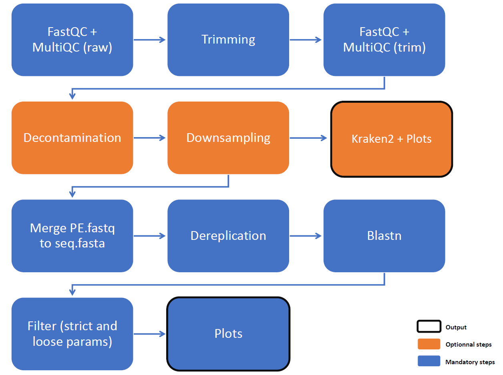

# BLASTN Amplicons Pipeline (Nextflow)

This pipeline processes Illumina paired-end amplicon sequencing data using Nextflow.
It performs quality control, optional preprocessing steps, and taxonomic identification with a dedicated Legionella workflow.

```
Pipeline_*/
├── assets/             static data (data/db/etc.) for Nextflow pipelines
├── bin/                scripts for modules files
├── config/             config files for Nextflow pipelines
├── modules/            modules files for Nextflow pipelines
├── SLURM/              sbatch scripts and config for launching Nextflow pipelines in SLURM mode
├── start_*             bash script for launching Nextflow pipelines in LOCAL mode
└── workflow_*          Nextflow main workflows
```




## Features

* Paired-end Illumina data only (single-end not supported)
* Quality control and filtering (QPhred and minimum length)
  * FastQC reports generated at each processing step
  * Detailed statistics files for traceability
* Optional preprocessing steps:
  * Adapter trimming
  * Decontamination against a human genome database
  * Downsampling to a user-defined fraction of reads
* Optional taxonomic assignment using Kraken2
* Dereplication and merging of FASTQ files into FASTA format
* **Sequence identification using BLASTN against a Legionella-specific database**
  * Two parameter sets are applied:
    * Strict mode: highly stringent thresholds to ensure high-confidence identifications
    * Loose mode: relaxed thresholds to explore borderline matches and assess whether less stringent parameters recover additional relevant signals
* Generation of visual outputs (e.g., barplots or Krona)
* Comprehensive tracking of all tools, versions, and parameters used (softwaresTrackfile)
* Full pipeline usage and parameters accessible via `--help`

---

## Run

```bash
./start_blast_amplicons.sh -d <seq_id> [options]
```

---

## Required

* `-d, --seq_id` : sequencing run ID (ex: for "Legionella-Amplicons-20260331", run_ID = 20260331)

## Options

### Input / Output

* `-i, --input` : path to the folder containing the raw data (Illumina sequencing)
* `-o, --output` : folder for results files, relevant to user 
* `-w, --work` : permanent backup folder for all output files, relevant to dev
* `-s, --save` : permanent backup folder for input data
* `-m, --tmp` : temporary backup folder for input data, removed when analysis ended

```
By default : 

/srv/autofs/nfs4/cluqumngs/TMP_IAI/04_CNR_Legionella/
├── NGS_results/
│   └── 23S-5S/
│       └── <sequencing_id>/
│           └── <YYYYMMDD>_Blast-amplicons/
│               └── results files, for User [--output]
│
├── Raw_fastq/
│   └── 23S-5S/
│       └── <sequencing_id>/
│           └── all input files [--save] <== not touched, only for data saving
│
/srv/scratch/iai/bachcl/
├── Raw_fastq/
│   └── Legionella/
│       └── 23S-5S/
│           └── <sequencing_id>/
│               └── all input files [--tmp] <== used during analysis and removed when ended
│
└── result/
    └── Legionella/
        └── 23S-5S/
            └── <sequencing_id>/
                └── <YYYYMMDD>_Blast-amplicons/
                    ├── work/ <== removed when analysis ended
                    └── all results and created files, for Dev [--work]
```

### Preprocessing

* `-a, --adapters` : enable adaptaters trimming

  * `True` : removes Illumina TruSeq Adapters (`by default`)
  * `False` : removes only bad quality reads - QPhred and minimum length

> Illumina TruSeq Adapter Read 1 :
> AGATCGGAAGAGCACACGTCTGAACTCCAGTCA 
>
> Illumina TruSeq Adapter Read 2 :
> AGATCGGAAGAGCGTCGTGTAGGGAAAGAGTGT

* `-e, --deconta` : enable decontamination of reads

  * `True` : keep the reads that are not aligned to the human database 
  * `False` : keep all the reads given as input (`by default`)

* `-n, --down` : enable downsampling

  * `float` : percentage of reads retained for analysis
  * if the option is not used, all the reads are kept for analysis (`by default`)

### Optionnal analysis

* `-k, --kraken` : enable classification with Kraken2

  * `True` : perform Kraken2 analysis (`by default`)
  * `False` : skip Kraken2

### Help to developpers

* `-c, --config` : path to a new nextflow config file, for developping new parameters

---

## Output annotation

* If multiple strains or species are detected for the same sequence after filtering BLAST results, the pipeline applies the following annotation rules:

  * When the species is identical but multiple strains are present, the strain is reported as `strain=Multi` (for multiple).
  * When different Legionella species are assigned to the same sequence, the result is marked as `Legionella spp., strain=NA`.

/!\ If you are not interested in this annotation, simply set the delta score threshold to -1, and the sequence will be annotated based on the best hit, or one of the best hits will be selected at random.

* If a match is found during the process but doesn't validate the filters, the sequence is annotated as `Not_assigned`, with the strain set to `Not_assigned`.

* If no match is found during the process, the sequence is annotated as `No_hit`, with the strain set to `No_hit`.
