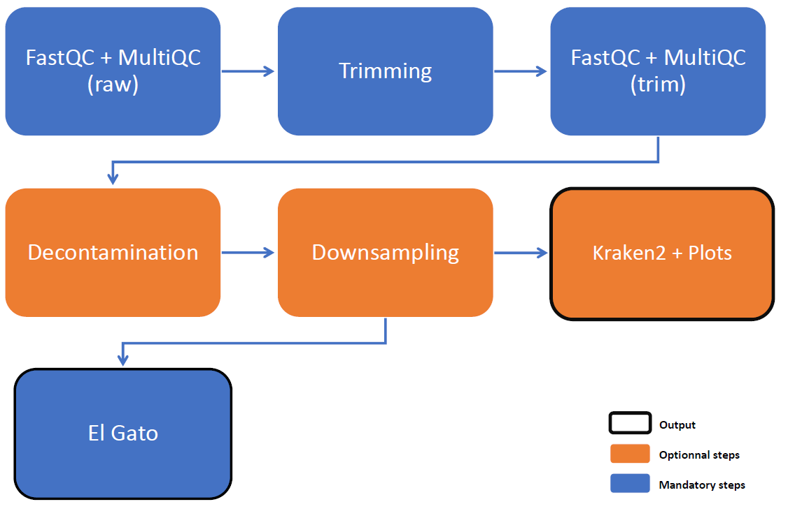

# EL GATO Nested SBT Pipeline (Nextflow)

This Nextflow pipeline processes Illumina paired-end Sequencing-Based Typing (SBT) data.
It includes quality control, optional preprocessing steps, taxonomic classification using Kraken2, and MLST profiling (El Gato).

```
Pipeline_*/
├── assets/             static data (data/db/etc.) for Nextflow pipelines
├── bin/                scripts for modules files
├── config/             config files for Nextflow pipelines
├── modules/            modules files for Nextflow pipelines
├── SLURM/              sbatch scripts and config for launching Nextflow pipelines in SLURM mode
├── start_*             bash script for launching Nextflow pipelines in LOCAL mode
└── workflow_*          Nextflow main workflows
```



---

## Features

* Paired-end Illumina data only (single-end not supported)
* Quality control and filtering (QPhred and minimum length)
  * FastQC reports generated at each processing step
  * Detailed statistics files for traceability
* Optional preprocessing steps:
  * Adapter trimming
  * Decontamination against a human genome database
  * Downsampling to a user-defined fraction of reads
* **Optional taxonomic assignment using Kraken2**
* **MLST-based Legionella typing**
* Generation of visual outputs (e.g., barplots or Krona)
* Comprehensive tracking of all tools, versions, and parameters used (softwaresTrackfile)
* Full pipeline usage and parameters accessible via `--help`

---

## Run

```bash
./start_elgato_sbt.sh -d <seq_id> [options]
```

---

## Required

* `-d, --seq_id` : sequencing run ID (ex: for "Legionella-Nested-SBT-20260331", run_ID = 20260331)

## Options

#### Input / Output

* `-i, --input` : path to the folder containing the raw data (Illumina sequencing)
* `-o, --output` : folder for results files, relevant to user 
* `-w, --work` : permanent backup folder for all output files, relevant to dev
* `-s, --save` : permanent backup folder for input data
* `-m, --tmp` : temporary backup folder for input data, removed when analysis ended

```
By default : 

/srv/autofs/nfs4/cluqumngs/TMP_IAI/04_CNR_Legionella/
├── NGS_results/
│   └── Nested_SBT/Illumina/
│       └── <sequencing_id>/
│           └── <YYYYMMDD>_ElGato-NestedSbt/
│               └── results files, for User [--output]
│
├── Raw_fastq/
│   └── Nested_SBT_NGS/
│       └── <sequencing_id>/
│           └── all input files [--save] <== not touched, only for data saving
│
/srv/scratch/iai/bachcl/
├── Raw_fastq/
│   └── Legionella/
│       └── Nested_SBT/
│           └── <sequencing_id>/
│               └── all input files [--tmp] <== used during analysis and removed when ended
│
└── result/
    └── Legionella/
        └── Nested_SBT/
            └── <sequencing_id>/
                └── <YYYYMMDD>_ElGato-NestedSbt/
                    ├── work/ <== removed when analysis ended
                    └── all results and created files, for Dev [--work]
```

#### Preprocessing

* `-a, --adapters` : enable adaptaters trimming

  * `True` : removes Illumina TruSeq Adapters (`by default`)
  * `False` : removes only bad quality reads - QPhred and minimum length

    > Illumina TruSeq Adapter Read 1 :
    > AGATCGGAAGAGCACACGTCTGAACTCCAGTCA 
    >
    > Illumina TruSeq Adapter Read 2 :
    > AGATCGGAAGAGCGTCGTGTAGGGAAAGAGTGT

* `-e, --deconta` : enable decontamination of reads

  * `True` : keep the reads that are not aligned to the human database 
  * `False` : keep all the reads given as input (`by default`)

* `-n, --down` : enable downsampling

  * `float` : percentage of reads retained for analysis
  * if the option is not used, all the reads are kept for analysis (`by default`)

#### Optionnal analysis

* `-k, --kraken` : enable classification with Kraken2

  * `True` : perform Kraken2 analysis (`by default`)
  * `False` : skip Kraken2

#### Help to developpers

* `-c, --config` : path to a new nextflow config file, for developping new parameters
