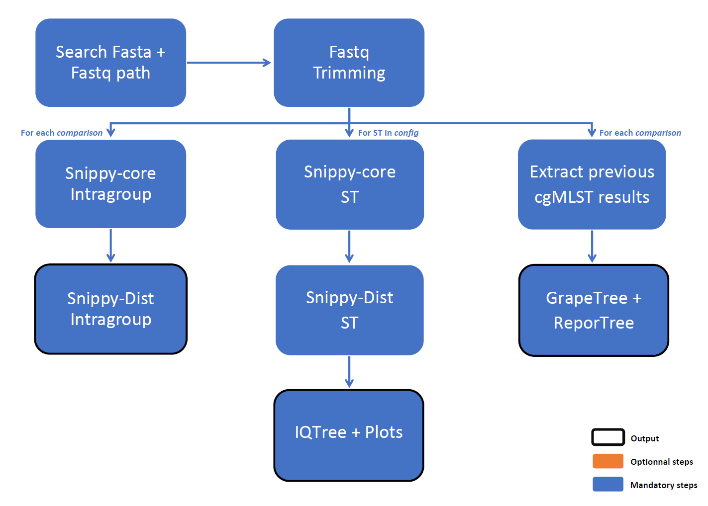

# Strain Comparison Pipeline (Nextflow)

This pipeline performs comparative genomic analyses between strains defined in a metadata file containing sample IDs, sequence types (ST), collection years and origin. It automatically retrieves the corresponding FASTA and FASTQ files, validates the input list, and performs multiple complementary analyses : SNP comparison, Phylogenetic analysis and/or cgMLST analysis.

```
Pipeline_*/
├── assets/             static data (data/db/etc.) for Nextflow pipelines
├── bin/                scripts for modules files
├── config/             config files for Nextflow pipelines
├── modules/            modules files for Nextflow pipelines
├── SLURM/              sbatch scripts and config for launching Nextflow pipelines in SLURM mode
├── start_*             bash script for launching Nextflow pipelines in LOCAL mode
└── workflow_*          Nextflow main workflows
```



---

## Features

* Performs a `Snippy/Snippy-core analysis` for each comparison, allowing pairwise SNP distance estimation between strains
* Generates `phylogenetic trees` for selected STs using external reference genomes, integrating previous and new Snippy results
* Retrieves profiles from global ChewBBACA table and performs `cluster zoom-in analyses` on the strains included in the current comparison (ReporTree) or generates `minimum spanning trees` (GrapeTree).
* Produces a summary file listing all software used and their parameters (softwaresTrackfile)
* Full execution details available via `--help`

---

## Run

```bash
./start_strain_comparison.sh -d <comparison_id> [options]
```

---

## Required

* `-d, --compare` : comparison ID (ex: for "Strains_20260730", comparison_ID = 20260730)
* A TSV metadata file named `Strains_{comparison_id}.txt` in `TMP_IAI/04_CNR_Legionella/Input_analysis_nextflow` folder, in the format specified by the file `assets/COMPARISON_strains_metadata.xlsx`

## Options

#### Input / Output

* `-o, --output` : folder for results files, relevant to user 
* `-w, --work` : permanent backup folder for all output files, relevant to dev
* `-m, --tmp` : temporary backup folder for input data, removed when analysis ended

```
By default : 

/srv/net/cluqumngs/TMP_IA/04_CNR_Legionella/
├── NGS_results/
│   └── Strain_comparison/
│       └── <comparison_id>/
│           └── <YYYYMMDD>_Strain-Comparison/
│               └── results files, for User [--output]
│
│
/srv/scratch/iai/bachcl/
├── Raw_fastq/
│   └── Legionella/
│       └── Strain_comparison/
│           └── <comparison_id>/
│               └── all input files [--tmp] <== used during analysis and removed when ended
│
└── result/
    └── Legionella/
        └── Strain_comparison/
            └── <comparison_id>/
                └── <YYYYMMDD>_Strain-Comparison/
                    ├── work/ <== removed when analysis ended
                    └── all results and created files, for Dev [--work]
```

#### Preprocessing

* `-t, --adapters` : enable adaptaters trimming

  * `True` : removes Illumina TruSeq Adapters (`by default`)
  * `False` : removes only bad quality reads - QPhred and minimum length

    > Illumina TruSeq Adapter Read 1 :
    > AGATCGGAAGAGCACACGTCTGAACTCCAGTCA 
    >
    > Illumina TruSeq Adapter Read 2 :
    > AGATCGGAAGAGCGTCGTGTAGGGAAAGAGTGT

#### Analysis mode

* `-z, --zoom` : enable ReporTree zoom functionality

  * `analyse` : show all samples from Strains.tsv `--meta` (`by default`)
  * `none` : disable zoom and shows default overview
  * `<sample_id>` : show selected selected sample IDs (such as `SampleA` or `SampleA,SampleB`)

* `-a, --meta` : TSV file containing metadata for all the samples

  * Path to TSV file, `by default : /srv/net/cluqumngs/TMP_IAI/04_CNR_Legionella/Input_analysis_nextflow/Strains_{comparison_id}.txt`
  * For more information about the file content, see : `assets/COMPARISON_strains_metadata.xlsx`

* `-s, --dbsnippy` : Path containing old Snippy results and the reference used

  * Path to folder, `by default : /srv/scratch/iai/bachcl/db/legio/Snippy`
  * The folder must contain subfolders named `ST<id_st>`, where id_st corresponds to the `st values in snippy_ref` within the configuration file. As well as the reference files as specified in the configuration file.

#### Help to developpers

* `-c, --config` : path to a new nextflow config file, for developping new parameters

---

## Annotation (LOG)

This part describes the annotations reported in the logs and their meaning.

### SNP-based analysis and phylogenetic tree generation

| Annotation | Description |
|---|---|
| `ONLY ONE SAMPLE` | Snippy-core was executed, but only one sequence was available in the comparison. Some output files may be incomplete or empty. |
| `NO VARIANT DETECTED` | Snippy-core was executed, but all samples are identical to the reference sequence and no variants were detected. Some output files may be incomplete or empty. |
| `NOT ENOUGH VARIANT` | Snippy-core was executed, but all samples are almost or completely identical to the reference sequence and not enough variants were detected. Some output files may be incomplete or empty. |
| `EMPTY ALIGNMENT` | IQ-TREE could not be executed because no core alignment was generated during the previous step. |
| `SKIPPING IQTREE` | IQ-TREE was skipped because the core alignment contains only one sequence, which is insufficient for phylogenetic inference. |
| `NO BOOTSTRAP` | Fewer than four sequences were available in the core alignment. The phylogenetic tree can be generated, but bootstrap support cannot be calculated. |
| `LESS THAN 4 SEQ` | Fewer than four sequences were available in the comparison. Gubbins filtering cannot be performed. |
| `EMPTY` | No sequence was available for the comparison. Gubbins filtering cannot be performed. |

### cgMLST analysis

| Annotation | Description |
|---|---|
| `SAMPLE MISSING FROM PREVIOUS` | The sample was not found in the previously generated cgMLST allele results (`previous` parameter in the configuration file). |
| `ONLY ONE ALLELIC PROFILE` | The retrieved allelic profiles are identical for all samples in the comparison. No phylogenetic tree can be generated from these profiles. |
| `NO ALLELIC PROFILE` | None of the samples in the comparison were found in the previously generated cgMLST allele results (`previous` parameter in the configuration file). |

---

## Information

* **Search rules** 

  * FASTA files are searched recursively in the provided directories, excluding any files located inside directories named exactly `scaffolds`; for each sample, only the newest matching FASTA file is selected.
  * FASTQ files are searched recursively in the provided directories; matching R1/R2 files are identified from the filename patterns, and only the newest file for each read direction and sample is selected.

* **Databse hierarchy**

  * `snippy_dir` directory (`dbsnippy` option) must contain subfolders named `ST<id_st>`, where id_st corresponds to the `st` values defined in `snippy_ref` in the configuration file. 
  * Each `ST<id_st>` folder must also contain the reference files specified in the configuration file.

* **Intra-strain comparisons**

  * Intra-strain comparisons are performed against the `first FASTA file found` in the metadata for the same comparison group. Therefore, the preference order follows the order of the samples as listed in the metadata file.
