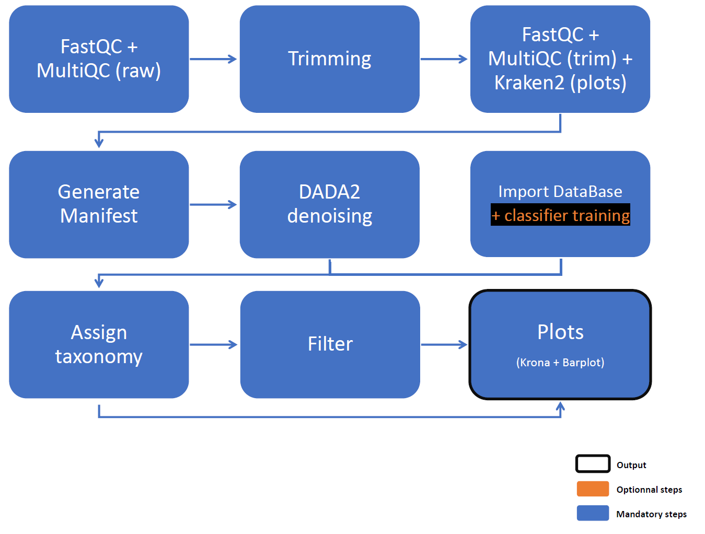

# nextflow_pipeline_legio

A collection of Nextflow pipelines dedicated to the analysis of Legionellosis-related data (CNR des Légionelles).

*/!\ The configuration files and values provided here are for information purposes only if the analyses are not run on machines belonging to HCL. The paths and certain options have been configured for those machines, and only the underlying logic and software can be applied in other environments.*

```
project/
├── assets/             static data (data/db/etc.) for Nextflow pipelines
├── bin/                scripts for modules files
├── config/             config files for Nextflow pipelines
├── img/                images used for ReadMe
├── launch_sh/          bash scripts for launching Nextflow pipelines in local mode
├── modules/            modules files for Nextflow pipelines
├── sbatch_env/         sbatch scripts for launching Nextflow pipelines in SLURM mode
├── nextflow_25.10.4    Nextflow executable 
└── workflows_*         Nextflow main workflows
```

---

- [Nextflow Pipeline Legio](#nextflow_pipeline_legio)
  - [QIIME2 Amplicons Pipeline](#qiime2-amplicons-pipeline-nextflow)
  - [BLASTN Amplicons Pipeline](#blastn-amplicons-pipeline-nextflow)
  - [EL GATO Nested SBT Pipeline](#el-gato-nested-sbt-pipeline-nextflow)


---

## QIIME2 Amplicons Pipeline (Nextflow)

#### Description
This pipeline analyzes Illumina amplicon sequencing data using QIIME2 and Nextflow.  
It supports single-end and paired-end data, optional adapters trimming, and two analysis modes: all samples together or separately; and taxonomic assignment using VSEARCH, BLASTN or a Bayesian classifier (sklearn).



---

#### Features

* Supports Illumina single-end and paired-end data
* Quality control and filtering (QPhred and minimum length)
  * Optional adapters trimming step
* Automatic QIIME2 data import and setup
* Taxonomic classification
  * BLAST+ consensus taxonomy classifier
  * Pre-fitted sklearn-based taxonomy classifier (Bayesian approach)
  * VSEARCH consensus taxonomy classifier
* **Builds a custom classifier** if not in `assets/qiime_amplicons/`
* Generates FastQC reports and visual outputs (Krona, Barplot)
* Flexible per-sample or global analysis
* Produces a summary file listing all software used and their parameters (softwaresTrackfile)
* Full execution details available via `--help`

---

#### Run

```bash
./launch_sh/start_qiime2_amplicons.sh -d <seq_id> [options]
```
---

#### Required

* `-d, --seq_id` : sequencing run ID (ex: for "Legionella-Amplicons-20260331", run_ID = 20260331)

#### Options

###### Input / Output

* `-i, --input` : path to the folder containing the raw data (Illumina sequencing)
* `-o, --output` : folder for results files, relevant to user 
* `-w, --work` : permanent backup folder for all output files, relevant to dev
* `-s, --save` : permanent backup folder for input data
* `-m, --tmp` : temporary backup folder for input data, removed when analysis ended

```
By default : 

/srv/autofs/nfs4/cluqumngs/TMP_IAI/04_CNR_Legionella/
├── NGS_results/
│   └── 23S-5S/
│       └── <sequencing_id>/
│           └── <YYYYMMDD>_Qiime2-amplicons/
│               └── results files, for User [--output]
│
├── Raw_fastq/
│   └── 23S-5S/
│       └── <sequencing_id>/
│           └── all input files [--save] <== not touched, only for data saving
│
/srv/scratch/iai/bachcl/
├── Raw_fastq/
│   └── Legionella/
│       └── 23S-5S/
│           └── <sequencing_id>/
│               └── all input files [--tmp] <== used during analysis and removed when ended
│
└── result/
    └── Legionella/
        └── 23S-5S/
            └── <sequencing_id>/
                └── <YYYYMMDD>_Qiime2-amplicons/
                    ├── work/ <== removed when analysis ended
                    └── all results and created files, for Dev [--work]
```

###### Sequencing mode

* `-pe, --paired` : Illumina data type

  * `True` : paired-end (`by default`)
  * `False` : singled-end

###### Preprocessing

* `-t, --adapters` : enable adaptaters trimming

  * `True` : removes Illumina TruSeq Adapters
  * `False` : removes only bad quality reads - QPhred and minimum length (`by default`)

> Illumina TruSeq Adapter Read 1 :
> AGATCGGAAGAGCACACGTCTGAACTCCAGTCA 
>
> Illumina TruSeq Adapter Read 2 :
> AGATCGGAAGAGCGTCGTGTAGGGAAAGAGTGT


###### Analysis mode

* `-a, --all` : run mode

  * `True` : all samples together
  * `False` : samples processed separately (`by default`)

* `-l, --classif` : taxonomy classifier

  * `blast` : use BLAST+ consensus taxonomy classifier
  * `sklearn` : use Pre-fitted sklearn-based taxonomy classifier (`by default`)
  * `vsearch` : use VSEARCH consensus taxonomy classifier

###### Help to developpers

* `-c, --config` : path to a new nextflow config file, for developping new parameters


---

#### DADA2 noise filtering and read sampling strategy 

During QIIME 2 processing, a noise reduction step is performed using DADA2. This step requires a sufficient number of reads to build an error model.

In some cases, individual samples may not contain enough reads to satisfy the training parameter defined in the configuration file. To handle this, the pipeline dynamically adjusts the number of reads used for DADA2 training.

After preprocessing, the pipeline compares:

* the number of available reads per sample
* the user-defined training parameter

It then selects the minimum of the two values, ensuring that:

* no more reads are used than available in the sample
* the training set is not arbitrarily reduced when sufficient data is available

This prevents inappropriate sampling (e.g., using 5,000 reads from a sample containing 100,000 reads when more data is needed for robust training).

#### Minimum filtering threshold

##### DADA2 denoising 

A hard-coded minimum threshold of 5,000 reads per sample is applied because the data are amplicons.

Samples below this threshold are considered insufficient for downstream analysis and are excluded.
All discarded samples are recorded in `4_Failed/Failed_TRIM.tsv` and marked as `LOW_READS_COUNT`.

##### Classification

When classifying using VSEARCH, BLAST or a Bayesian classifier, it is possible that sequences may not be assigned to any taxon depending on the contents of the database. 
For example, in our case, if the database contains only Legionella sequences but not the sample to be analysed, Qiime2 will not be able to assign a taxon to it and will return an error. 

To address this, a filter has been implemented in the pipeline. The classification step never returns errors but writes to a file whether or not the sample has been successfully assigned to a taxon. 

Either: 

* a taxon has been identified, and the sample will proceed through the pipeline without issue. 
* no matches have been found, and the sample is removed from further analysis.
* an error has occurred during the classification stage, and the sample is removed from further analysis (often: tmp files are empty).

For the latter two cases, a file is created in `4_Failed/Failed_CLASSIFY.tsv` stating the reason for removal, namely `NO_HIT` or `TECH_FAIL`.

##### Unassigned out

In addition, if unassigned taxa are removed from the QIIME 2 results (`_initKrona` and `_initBarplot`) and the generation of `_filtKrona` or `_filtBarplot` produces empty files (i.e. no reads have been assigned to any taxon), the sample name is written to the file `4_Failed/Failed_TAXAFILTER.tsv` with the annotation `EMPTY`. The sample is then removed from further analysis.

---

<div class="page"/>


## BLASTN Amplicons Pipeline (Nextflow)

#### Description
This pipeline processes Illumina paired-end amplicon sequencing data using Nextflow.
It performs quality control, optional preprocessing steps, and taxonomic identification with a dedicated Legionella workflow.


---

#### Features

* Paired-end Illumina data only (single-end not supported)
* Quality control and filtering (QPhred and minimum length)
  * FastQC reports generated at each processing step
  * Detailed statistics files for traceability
* Optional preprocessing steps:
  * Adapter trimming
  * Decontamination against a human genome database
  * Downsampling to a user-defined fraction of reads
* Optional taxonomic assignment using Kraken2
* Dereplication and merging of FASTQ files into FASTA format
* **Sequence identification using BLASTN against a Legionella-specific database**
  * Two parameter sets are applied:
    * Strict mode: highly stringent thresholds to ensure high-confidence identifications
    * Loose mode: relaxed thresholds to explore borderline matches and assess whether less stringent parameters recover additional relevant signals
* Generation of visual outputs (e.g., barplots or Krona)
* Comprehensive tracking of all tools, versions, and parameters used (softwaresTrackfile)
* Full pipeline usage and parameters accessible via `--help`

---

#### Run

```bash
./launch_sh/start_blast_amplicons.sh -d <seq_id> [options]
```

---

#### Required

* `-d, --seq_id` : sequencing run ID (ex: for "Legionella-Amplicons-20260331", run_ID = 20260331)

#### Options

###### Input / Output

* `-i, --input` : path to the folder containing the raw data (Illumina sequencing)
* `-o, --output` : folder for results files, relevant to user 
* `-w, --work` : permanent backup folder for all output files, relevant to dev
* `-s, --save` : permanent backup folder for input data
* `-m, --tmp` : temporary backup folder for input data, removed when analysis ended

```
By default : 

/srv/autofs/nfs4/cluqumngs/TMP_IAI/04_CNR_Legionella/
├── NGS_results/
│   └── 23S-5S/
│       └── <sequencing_id>/
│           └── <YYYYMMDD>_Blast-amplicons/
│               └── results files, for User [--output]
│
├── Raw_fastq/
│   └── 23S-5S/
│       └── <sequencing_id>/
│           └── all input files [--save] <== not touched, only for data saving
│
/srv/scratch/iai/bachcl/
├── Raw_fastq/
│   └── Legionella/
│       └── 23S-5S/
│           └── <sequencing_id>/
│               └── all input files [--tmp] <== used during analysis and removed when ended
│
└── result/
    └── Legionella/
        └── 23S-5S/
            └── <sequencing_id>/
                └── <YYYYMMDD>_Blast-amplicons/
                    ├── work/ <== removed when analysis ended
                    └── all results and created files, for Dev [--work]
```

###### Preprocessing

* `-a, --adapters` : enable adaptaters trimming

  * `True` : removes Illumina TruSeq Adapters (`by default`)
  * `False` : removes only bad quality reads - QPhred and minimum length

> Illumina TruSeq Adapter Read 1 :
> AGATCGGAAGAGCACACGTCTGAACTCCAGTCA 
>
> Illumina TruSeq Adapter Read 2 :
> AGATCGGAAGAGCGTCGTGTAGGGAAAGAGTGT

* `-e, --deconta` : enable decontamination of reads

  * `True` : keep the reads that are not aligned to the human database 
  * `False` : keep all the reads given as input (`by default`)

* `-n, --down` : enable downsampling

  * `float` : percentage of reads retained for analysis
  * if the option is not used, all the reads are kept for analysis (`by default`)

###### Optionnal analysis

* `-k, --kraken` : enable classification with Kraken2

  * `True` : perform Kraken2 analysis (`by default`)
  * `False` : skip Kraken2

###### Help to developpers

* `-c, --config` : path to a new nextflow config file, for developping new parameters

---

#### Output annotation

* If multiple strains or species are detected for the same sequence after filtering BLAST results, the pipeline applies the following annotation rules:

  * When the species is identical but multiple strains are present, the strain is reported as `strain=Multi` (for multiple).
  * When different Legionella species are assigned to the same sequence, the result is marked as `Legionella spp., strain=NA`.

/!\ If you are not interested in this annotation, simply set the delta score threshold to -1, and the sequence will be annotated based on the best hit, or one of the best hits will be selected at random.

* If a match is found during the process but doesn't validate the filters, the sequence is annotated as `Not_assigned`, with the strain set to `Not_assigned`.

* If no match is found during the process, the sequence is annotated as `No_hit`, with the strain set to `No_hit`.

---

<div class="page"/>

## EL GATO Nested SBT Pipeline (Nextflow)

#### Description
This Nextflow pipeline processes Illumina paired-end Sequencing-Based Typing (SBT) data.
It includes quality control, optional preprocessing steps, taxonomic classification using Kraken2, and MLST profiling (El Gato).


---

#### Features

* Paired-end Illumina data only (single-end not supported)
* Quality control and filtering (QPhred and minimum length)
  * FastQC reports generated at each processing step
  * Detailed statistics files for traceability
* Optional preprocessing steps:
  * Adapter trimming
  * Decontamination against a human genome database
  * Downsampling to a user-defined fraction of reads
* **Optional taxonomic assignment using Kraken2**
* **MLST-based Legionella typing**
* Generation of visual outputs (e.g., barplots or Krona)
* Comprehensive tracking of all tools, versions, and parameters used (softwaresTrackfile)
* Full pipeline usage and parameters accessible via `--help`

---

#### Run

```bash
./launch_sh/start_elgato_sbt.sh -d <seq_id> [options]
```

---

#### Required

* `-d, --seq_id` : sequencing run ID (ex: for "Legionella-Nested-SBT-20260331", run_ID = 20260331)

#### Options

###### Input / Output

* `-i, --input` : path to the folder containing the raw data (Illumina sequencing)
* `-o, --output` : folder for results files, relevant to user 
* `-w, --work` : permanent backup folder for all output files, relevant to dev
* `-s, --save` : permanent backup folder for input data
* `-m, --tmp` : temporary backup folder for input data, removed when analysis ended

```
By default : 

/srv/autofs/nfs4/cluqumngs/TMP_IAI/04_CNR_Legionella/
├── NGS_results/
│   └── Nested_SBT/Illumina/
│       └── <sequencing_id>/
│           └── <YYYYMMDD>_ElGato-NestedSbt/
│               └── results files, for User [--output]
│
├── Raw_fastq/
│   └── Nested_SBT_NGS/
│       └── <sequencing_id>/
│           └── all input files [--save] <== not touched, only for data saving
│
/srv/scratch/iai/bachcl/
├── Raw_fastq/
│   └── Legionella/
│       └── Nested_SBT/
│           └── <sequencing_id>/
│               └── all input files [--tmp] <== used during analysis and removed when ended
│
└── result/
    └── Legionella/
        └── Nested_SBT/
            └── <sequencing_id>/
                └── <YYYYMMDD>_ElGato-NestedSbt/
                    ├── work/ <== removed when analysis ended
                    └── all results and created files, for Dev [--work]
```

###### Preprocessing

* `-a, --adapters` : enable adaptaters trimming

  * `True` : removes Illumina TruSeq Adapters (`by default`)
  * `False` : removes only bad quality reads - QPhred and minimum length

> Illumina TruSeq Adapter Read 1 :
> AGATCGGAAGAGCACACGTCTGAACTCCAGTCA 
>
> Illumina TruSeq Adapter Read 2 :
> AGATCGGAAGAGCGTCGTGTAGGGAAAGAGTGT

* `-e, --deconta` : enable decontamination of reads

  * `True` : keep the reads that are not aligned to the human database 
  * `False` : keep all the reads given as input (`by default`)

* `-n, --down` : enable downsampling

  * `float` : percentage of reads retained for analysis
  * if the option is not used, all the reads are kept for analysis (`by default`)

###### Optionnal analysis

* `-k, --kraken` : enable classification with Kraken2

  * `True` : perform Kraken2 analysis (`by default`)
  * `False` : skip Kraken2

###### Help to developpers

* `-c, --config` : path to a new nextflow config file, for developping new parameters

---

<div class="page"/>